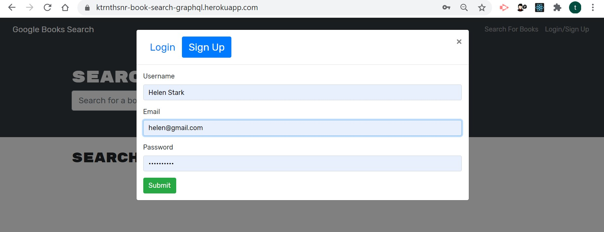
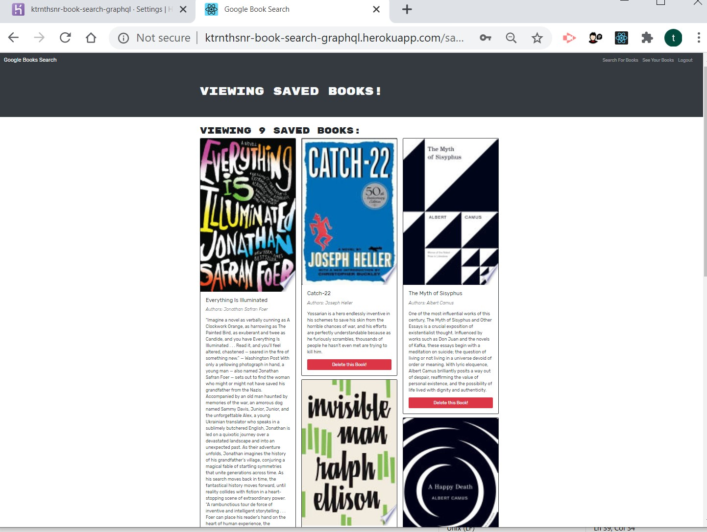
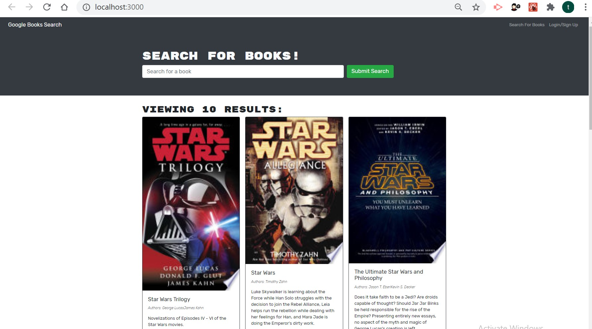
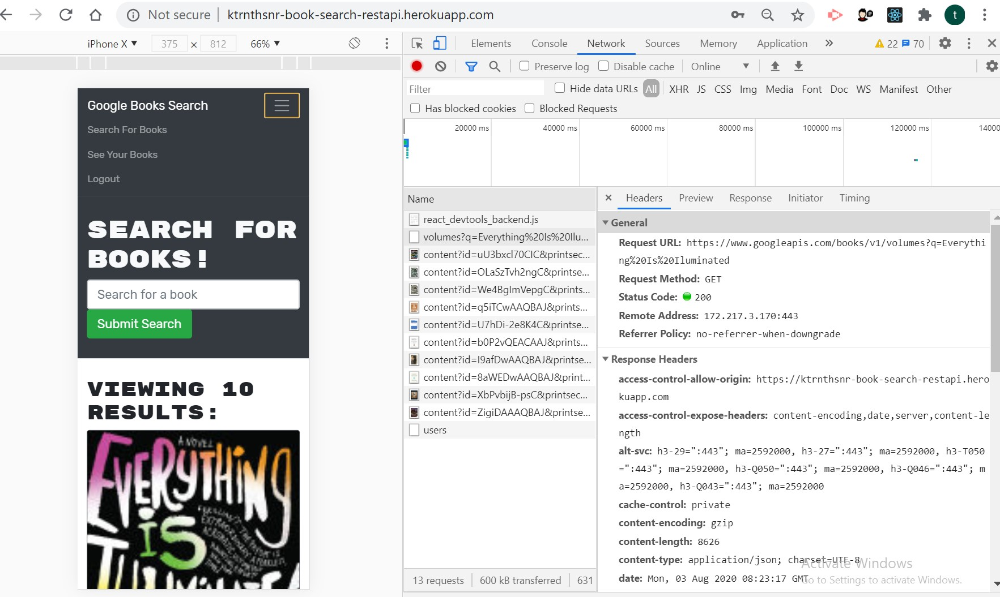

# Book Search Engine

Google Books API search engine originally built with a RESTful API, then refactored in this project into a GraphQL API built with Apollo Server.

## GitHub URL

https://github.com/ktrnthsnr/Book-Search-Engine

## Heroku deployed website

- Before refactor as REST API
    https://ktrnthsnr-book-search-restapi.herokuapp.com/ 

- After refactor as GraphQL API 
    https://ktrnthsnr-book-search-graphql.herokuapp.com/

## Table of Contents

* [Description](#description)
* [Technology](#technology)
* [Installations](#installations)
* [Usage](#usage)
* [Testing](#testing)
* [Contribution](#contribution)
* [React](#react)

## Description

The task for this repo will be to refactor the code from one set of libraries to a different set.

- Original: The original application was built using the MERN stack, with a RESTful API, with a React front-end and MongoDB, Node.js/Express.js server and API.

- New: The refactored application would have been converted to use GraphQL API built with an Apollo Server, with updated back-end server and auth middleware, and a new schemas directory to include typeDefs and resolvers. The front-end files added to convert to GraphQL will be replacing the client API file config from the original to new Apoollo\QueryQL queries and mutations.

This project is focused on full-stack web development using MERN stack tools, languages, and npm libraries, with emphasis on GraphQL, a query language for APIs and runtime for completing queries, and the Apollo client and npm packages which will integrate GraphQL into the Express.js server.

Steps completed for this project to refactor the code from a REST API to a GraphQL API:

	1. Created Apollo Server and integrate with an Express.js server 
	2. Updated existing authentication to integrate with the GraphQL API, updating the client front-end to allow for registration and login of a user using mutuations, and then added authentication
	3. Added an Apollo Provider and have requests sent to the Apollo server
	4. Created GraphQL API endpoints
	5. To validate, ran GraphQL queries and mutations within the localhost dev server in the GraphQL playgrounds, fetching, displaying, and updating data within the backend
	6. Deployed the MERN application as a Heroku app, with an mLab add-on resource

## Technology

Node.js, JavaScript, ES6, npm MongoDB, Mongoose, Express.js, React.js, GraphQL, GraphQL Playground, Apollo Server, Apollo-Client, graphql-tag, apollo-server-express, apollo-boost, React Router, react-router-dom, apollo/react-hooks, if-env, concurrently, jsonwebtoken, jwt-decode, faker, nodemon, bcrypt, moment, Heroku, mlab.

## Installations

- Prereq: install to your desktop VSCode, Node.js, and MongoDB
- After cloning the GitHub repo to your local drive, run the following in the VSCode command-line terminal
- Install all components listed within the package.json file for npm
- From the root run $ `npm i`

- Check the package.json from each client and server folder have all dependencies installed. If there any missing, try installing from each of these directories.

    - Server 
    - $ `cd server`
    - $ `npm i`
     - Client
    - $ `cd client`
    - $ `npm i`

- Otherwise, for custom individual component installations, install the npm packages per each server and client:

### Server-side installations
- Original `server` dependencies before refactor to QueryQL and Apollo server, with added packages

    ```
    "dependencies": {
        "apollo-server-express": "^2.16.1", -- installed for refactor
        "bcrypt": "^4.0.1",        
        "express": "^4.17.1",
        "faker": "^4.1.0",
        "jsonwebtoken": "^8.5.1",   -- installed for refactor
        "moment": "^2.24.0", 
        "mongoose": "^5.9.9"
    },
    "devDependencies": {
        "nodemon": "^2.0.3"
    ```

- Npm packages installed under the /server folder:
    - Under the /server folder, create a .gitignore file in the root and add `node_modules` to this file
    - Install these npm packages under the server folder:
    - $ `cd server`
    - brcrypt `npm install bcrypt`
    - express.js `npm i express`
    - faker `npm i faker`
    - jsonwebtoken  `npm install jsonwebtoken`
    - moment `npm install moment`
    - mongoose `npm install mongoose`
- Npm packages installed in the /server folder to setup for GraphQL, run the following:
    - Install the Apollo Server library $ `npm i apollo-server-express`
    - For user authentication, to be able to encode a JSON object into a tokenized string, install JSON Web Token (JWT) package $ `npm install jsonwebtoken` 

- Files and folders created and updated for the server-side refactor: 
    - New folder: /server/schemas
      - Files: typeDefs.js, resolvers.js, indes.jx
    - Updated files: /server/server.js, /server/utils/auth.js


### Client-side installations 

- Original `client` dependencies before refactor to QueryQL and Apollo server

    ```
    "dependencies": {
        "@testing-library/jest-dom": "^4.2.4",
        "@testing-library/react": "^9.3.2",
        "@testing-library/user-event": "^7.1.2",
        "bootstrap": "^4.4.1",
        "jwt-decode": "^2.2.0",
        "react": "^16.13.1",
        "react-bootstrap": "^1.0.1",
        "react-dom": "^16.13.1",
        "react-router-dom": "^5.1.2",
        "react-scripts": "3.4.1"
        }
    ```
- Npm packages installed under the /client folder:
     - Under the /client folder, create a .gitignore file in the root and add `node_modules` to this file
     - Create the React App tool if cloned the repo, by first changing directory to the client folder
        - $ `cd client`
        - $ `npx create-react-app .` 
        - (New installs without repo cloning, run $ `npx create-react-app client`)

 - Installed additional dependent npm packages
    - apollo-boost `npm i apollo-boost graphql graphql-tag @apollo/react-hooks` 
        - This installs the required packages for Apollo and GraphSQL in React on the client side:
            - apollo-boost (for client)
            - graphql-tag (formats GraphQL queries)
            - @apollo/apollo-hooks (executes GraphQL queries as React Hooks)
            - graphql       
    - react-router-dom `npm i react-router-dom`
    - for JSON Token authentication within the client, installed jwt-decode `npm i jwt-decode`

    - jest-dom `npm install @testing-library/react @testing-library/jest-dom --save-dev`
    - bootstrap `npm i bootstrap`
    - popper  `npm i popper.js`
    - jQuery `npm i jquery`
    - jwt-decode `npm i jwt-decode`
    - react-bootstrap `npm i react-bootstrap`
    - react-dom `npm i react-dom`

    - react-scripts `npm i react-scripts`
  - For the refactor to GraphQL and Apollo server, these packages were installed
    - React Router `npm i react-router`
    - nodemon `npm i nodemon`
    - apollo/react-hooks `npm i @apollo/react-hooks`
    - if-env `npm i if-env`
    - concurrently `npm i concurrently`
    - graphql-tag `npm i graphql-tag`

- Files and folders created and updated for the client-side refactor: ` 
    - New folder: /client/*
      - Files: queries.js, mutations.js, SearchBooks.js, SavedBooks.js
    - Updated files: /client/src/Apps.js

### Third server installations 

- From the root, created a third application to control the client and server applications.
- $ `npm init -y`
- Also installed
-  if-env library $ `npm install if-env`
-  concurrently library as a dependency for development environment only `npm install -D concurrently`


## Usage

### Website
- The website has been deployed to Heroku before and after the refactor exercise, before and after utilizing GraphQL\Apollo.

    - Before refactor as REST API
        https://ktrnthsnr-book-search-restapi.herokuapp.com/ 

    - After refactor as GraphQL API 
        https://ktrnthsnr-book-search-graphqlapi.herokuapp.com/ 
	
- The webiste allows for Sign-Up and Login
    

- One signed up and logged in, a user may save their book list
    

#### Localhost deployment

- If cloned to your localhost, after the installations, to start the Node.js application, run from the root in bash, which will start both the client and server side applications.  Currently the environment config is setup within the server/server.js and root package.json files.
- $ `npm start`

### Local install, seed and usage 

- Steps completed prior to the deployment:

#### Server-side
- To view the site locally on the development server, first installed the npm packages
    - $ `npm i` or `npm install`
- Then seed the data (not required if gathing data from a third party API, such as Google API. Instead connect to the Google Books API)
    - $ `npm run seed`
- Start the MongoDB
    - $ `mongod`
- To test the Apollo server sider connections to the Express.js, (to test the schemas and server.js), run the following 
    - $ `cd server`
    - $ `npm run watch`
- This allows for queries and any file changes without having to restart the server. The config is setup in the server/package.json to run nsodeman, "watch": "nodemon".
- Use GraphQL Playground server environment, view locally at `http://localhost:3001/graphql`
- Sample queries can be copied to GraphQL Playground from the ./GraphqlPlayground-queries.md. <in work>

- If npm run watch requires additional npm packages, the server side dependencies as listed under /server/package.json. See installations for more info.


#### Client-side
- Clone the repo to your local drive, install the npm packages to the /server folder first, then these to the /client folder
    - $ `cd client`
    - $ `npm i` or `npm install`
- Then start up the app. The React app client starts up by running from the client directory
    - $ `cd client`
    - $ `npm start`
- The default browser will open the development server to your localhost, at `http://localhost:3000/`

- Here is a search sample from the dev server, 
	

- If npm start requires additional npm packages, the client side dependencies are located at /client/package.json. See installations for more info.


## Testing

See Usage > server-side.

The Chrome DevTools can validate API connections. Here a right click on the page opens DevTools showing the mobile-first single-page appication design and request\response to the GoogleAPI/books, as follows,




## Contribution

ktrnthsnr

### ©️2020 ktrnthsnr


## React

This project was bootstrapped with [Create React App](https://github.com/facebook/create-react-app).

## Available Scripts

In the project directory, you can run:

### `npm start`

Runs the app in the development mode.<br />
Open [http://localhost:3000](http://localhost:3000) to view it in the browser.

The page will reload if you make edits.<br />
You will also see any lint errors in the console.

### `npm test`

Launches the test runner in the interactive watch mode.<br />
See the section about [running tests](https://facebook.github.io/create-react-app/docs/running-tests) for more information.

### `npm run build`

Builds the app for production to the `build` folder.<br />
It correctly bundles React in production mode and optimizes the build for the best performance.

The build is minified and the filenames include the hashes.<br />
Your app is ready to be deployed!

See the section about [deployment](https://facebook.github.io/create-react-app/docs/deployment) for more information.

### `npm run eject`

**Note: this is a one-way operation. Once you `eject`, you can’t go back!**

If you aren’t satisfied with the build tool and configuration choices, you can `eject` at any time. This command will remove the single build dependency from your project.

Instead, it will copy all the configuration files and the transitive dependencies (webpack, Babel, ESLint, etc) right into your project so you have full control over them. All of the commands except `eject` will still work, but they will point to the copied scripts so you can tweak them. At this point you’re on your own.

You don’t have to ever use `eject`. The curated feature set is suitable for small and middle deployments, and you shouldn’t feel obligated to use this feature. However we understand that this tool wouldn’t be useful if you couldn’t customize it when you are ready for it.

## Learn More

You can learn more in the [Create React App documentation](https://facebook.github.io/create-react-app/docs/getting-started).

To learn React, check out the [React documentation](https://reactjs.org/).

### Code Splitting

This section has moved here: https://facebook.github.io/create-react-app/docs/code-splitting

### Analyzing the Bundle Size

This section has moved here: https://facebook.github.io/create-react-app/docs/analyzing-the-bundle-size

### Making a Progressive Web App

This section has moved here: https://facebook.github.io/create-react-app/docs/making-a-progressive-web-app

### Advanced Configuration

This section has moved here: https://facebook.github.io/create-react-app/docs/advanced-configuration

### Deployment

This section has moved here: https://facebook.github.io/create-react-app/docs/deployment

### `npm run build` fails to minify

This section has moved here: https://facebook.github.io/create-react-app/docs/troubleshooting#npm-run-build-fails-to-minify
